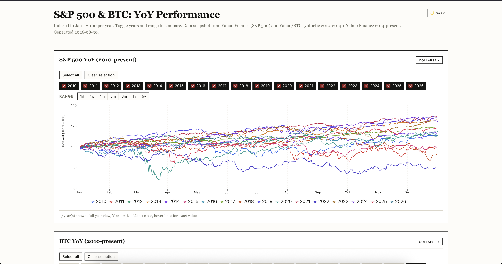
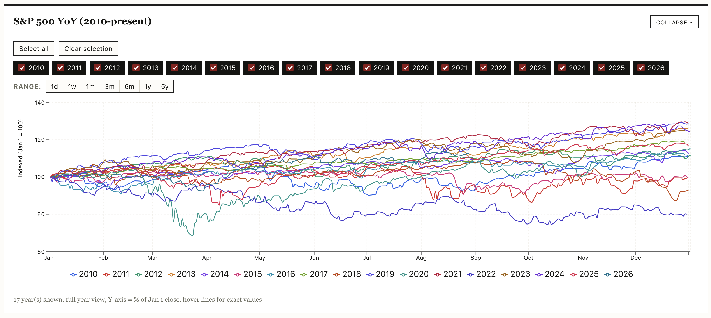
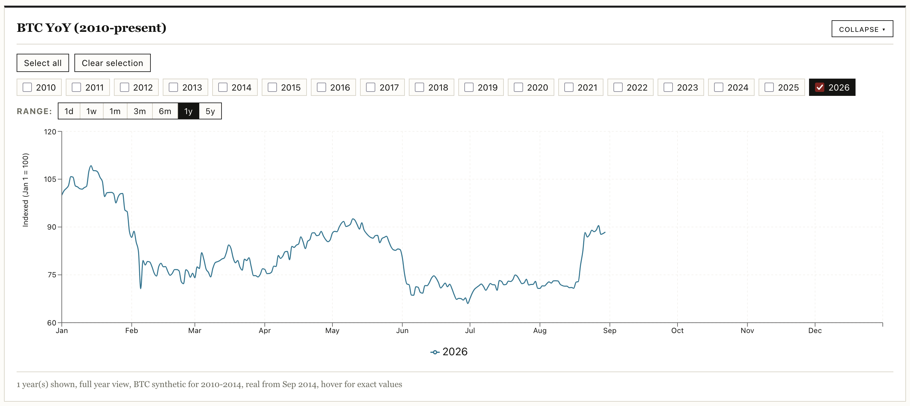
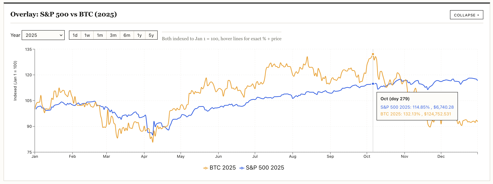

# snp-btc-yoy

S&P 500 & BTC Year-over-Year Performance: static site on GitHub Pages. This started because I wanted correlate S&P 500 performance against BTC in different years, and couldn't find an uncluttered view of this online.

**Live site:** [https://vlvagerviwager.github.io/snp-btc-yoy/](https://vlvagerviwager.github.io/snp-btc-yoy/) (GitHub Pages, served from `site/dist`)



Interactive static site with 3 charts:

1. **S&P 500 YoY**: multi-series line chart, one line per year (2010-present), indexed to Jan 1 = 100
2. **BTC YoY**: same, for BTC (2010-present; 2010-2014 synthetic seeded from Yahoo BTC-USD Sep 2014 first close, 2014-present real)
3. **Overlay: S&P 500 vs BTC**: pick a year, see both assets indexed together for direct comparison

## Features

- year multi-select per chart (Select all / Clear selection, URL `?sp=2024,2025&btc=2025&overlay=2024`)
- range filters `1d/1w/1m/3m/6m/1y/5y` per chart (mutually exclusive with year selection, shows recent performance)
- hover tooltips with exact indexed + price
- dark mode (OS `prefers-color-scheme` default + binary Light/Dark toggle persisted in `localStorage`)
- responsive layout, stacked full-width charts
- collapsible charts
- serif headings and copy, sans for buttons and filters, no rounded borders

## Stack

- Vite + React + TypeScript + Recharts
- Bun as package manager
- Vitest + Testing Library + jsdom (no-browser)
- snapshot JSON data in `site/public/data/` (generated by `site/scripts/fetch-data.ts` from Yahoo Finance `^GSPC`/`BTC-USD`; BTC 2010-2014 padded deterministic synthetic)

**License:** PolyForm Noncommercial 1.0.0: see [LICENSE](LICENSE). Commercial use requires separate license.

## Run locally

Prereqs: [Bun](https://bun.sh) (`curl -fsSL https://bun.sh/install | bash`), Node 20+ for tooling.

```bash
# install deps
bun install --cwd site

# (optional) refresh data snapshot: writes site/public/data/sp500.json, btc.json from Yahoo
# falls back to synthetic if offline; commit the result if you want to update the snapshot
bun run --cwd site fetch-data

# dev server
bun run --cwd site dev
# -> http://localhost:5173/snp-btc-yoy/

# typecheck, tests, build
bun run --cwd site typecheck
bun run --cwd site test
bun run --cwd site build   # outputs site/dist (gitignored, deployed to Pages)

# preview production build
bun run --cwd site preview
```

Agent skills (used to build this) were installed via Bun:

```bash
curl -fsSL https://bun.sh/install | bash
bunx --bun skills add addyosmani/agent-skills --agent opencode --all -y
# skills land in .agents/skills/ and are linked to .opencode/skills/
```

## Data

- **S&P 500** daily closes from Yahoo Finance `^GSPC` (free, no key), 2010-present.
- **BTC** from Yahoo `BTC-USD` (Sep 2014-present) padded with synthetic 2010-2014 (deterministic random walk from 0.30 -> first Yahoo close).
- Snapshot normalized per-year to Jan 1 = 100 (`indexed`). Raw closes retained for tooltips.

## Tests & CI

- `site/tests/`: 5 files, 12 tests: 3 charts render, non-empty, year filter, theme toggle, normalize unit.
- `.github/workflows/ci.yml`: runs on push/PR to `main`: typecheck + tests + build, deploys `site/dist` to GitHub Pages on `main`.

## Screenshots





## Backlog

- verify values
- make public and set up GitHub Pages
- verify deployment job
